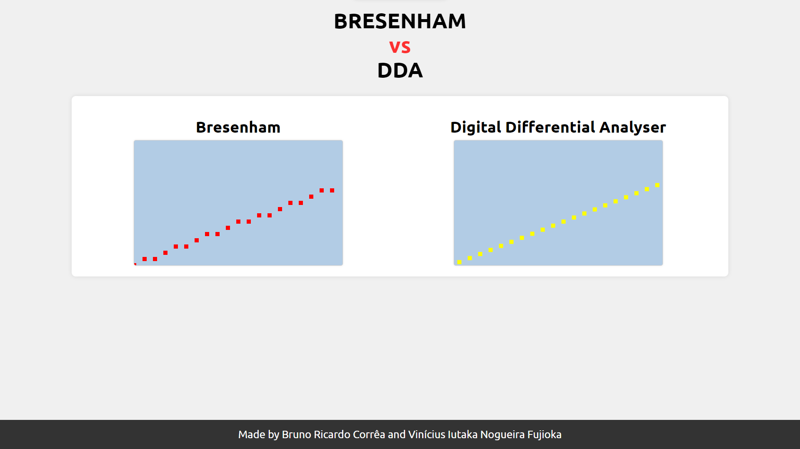

# LINKEDIN POSTS

This repository was created to host the code used in the posts I make on LinkedIn. The posts are about technologies, programming languages, tools, and other topics related to software development.

## Posts
 - 1 - [DDA vs Bresenham](https://www.linkedin.com/posts/brunorcorrea_ol%C3%A1-pessoal-hoje-gostaria-de-comentar-sobre-activity-7177418679104454656-20Jv?utm_source=share&utm_medium=member_desktop)
    